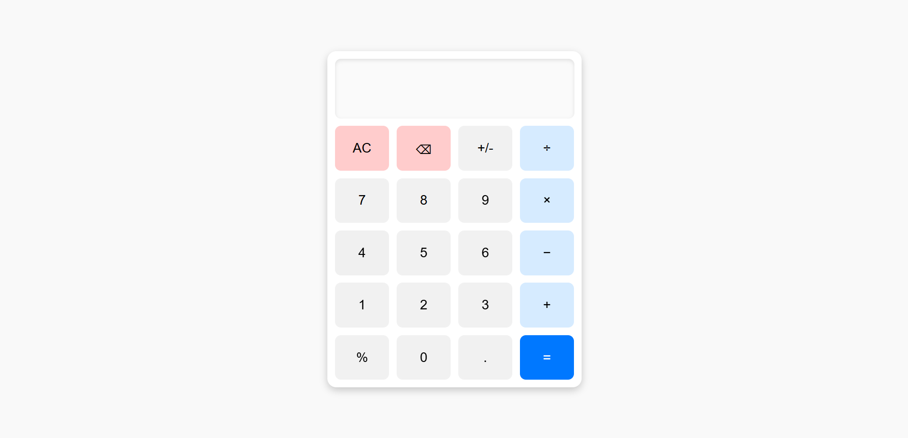

# CodeAlpha_task2
Calculator Project

Description

This is a simple Calculator Project that provides basic arithmetic operations such as addition, subtraction, multiplication, and division. The project is designed for beginners who have essential knowledge of HTML, CSS, and JavaScript. It includes a user-friendly interface with buttons for entering data and a display screen for showing results.

Features

Basic arithmetic operations (Addition, Subtraction, Multiplication, Division)

User-friendly interface with interactive buttons

Real-time display updates

Error handling for invalid inputs (e.g., division by zero)

Technologies Used

HTML

CSS

JavaScript

## Screenshot of the web page

